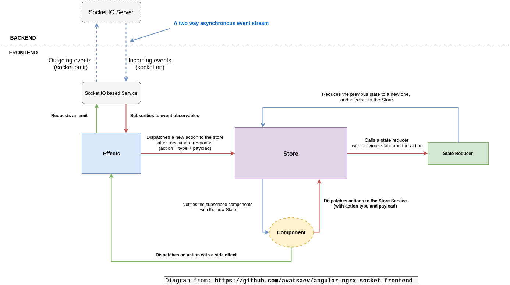

# Angular-9 App for POC

* [Node + npm](https://nodejs.org/)
* [Angular CLI](https://cli.angular.io/) v6+
* NgRx
* WebSocket Client
* Angular 9
* Material Design
* [Auth0 account](https://auth0.com) with [application](https://manage.auth0.com/#/applications)

This repo is intended to be supplemental to the tutorials. Reference the tutorials for full implementation details.

## Install

Clone this repository, then run:

```
$ npm install
```

## Setup

* Add your Auth0 and MongoDB credentials and remove `.SAMPLE` extension: `server/config.js.SAMPLE`
* Add your Auth0 credentials and remove `.SAMPLE` extension: `src/app/auth/auth.config.ts.SAMPLE`

## Development server

```bash
$ npm run dev
```

App available at `http://localhost:4200`.
Server available at `http://localhost:8083/api`.

## Build (local)

```
$ ng build --prod
```

### Different POCs

## 1. Event Driven UI using NgRx + Websocket + NestJS

#### Ngrx + Effects with a simple REST Service

- This is basic example where we are getting data from http api calls 
- write NgRx store/action/reducers and effects to deal with async calls 
- HTTP calls will trigger action, effects and update store 
- Angular components will get data from updates store data

Now what if we add socket service in above picture, the change is now we have socket push events coming 
from which we can get data, we just need socket client to connect and receive and send events to socket api server


#### Ngrx + Effects with a simple REST and Socket Service 

- NgRx will work same as it was just addition of another type of effects (web socket events)
- Now with HTTP events we will also capture web socket events and get updated data



## 2. POC on using auth0 with Angular Client

Auth0 helps you to:

* Add authentication with [multiple authentication sources](https://docs.auth0.com/identityproviders), either social like **Google, Facebook, Microsoft Account, LinkedIn, GitHub, Twitter, Box, Salesforce, amont others**, or enterprise identity systems like **Windows Azure AD, Google Apps, Active Directory, ADFS or any SAML Identity Provider**.
* Add authentication through more traditional **[username/password databases](https://docs.auth0.com/mysql-connection-tutorial)**.
* Add support for **[linking different user accounts](https://docs.auth0.com/link-accounts)** with the same user.
* Support for generating signed [Json Web Tokens](https://docs.auth0.com/jwt) to call your APIs and **flow the user identity** securely.
* Analytics of how, when and where users are logging in.
* Pull data from other sources and add it to the user profile, through [JavaScript rules](https://docs.auth0.com/rules).

## Create a Free Auth0 Account

1. Go to [Auth0](https://auth0.com) and click Sign Up.
2. Use Google, GitHub, or Microsoft Account to log in.

## Issue Reporting

If you have found a bug or if you have a feature request, please report them at this repository issues section. Please do not report security vulnerabilities on the public GitHub issue tracker. The [Responsible Disclosure Program](https://auth0.com/whitehat) details the procedure for disclosing security issues.

## Author

[Auth0](auth0.com)

## License

This project is licensed under the MIT license. See the [LICENSE](LICENSE) file for more info.
